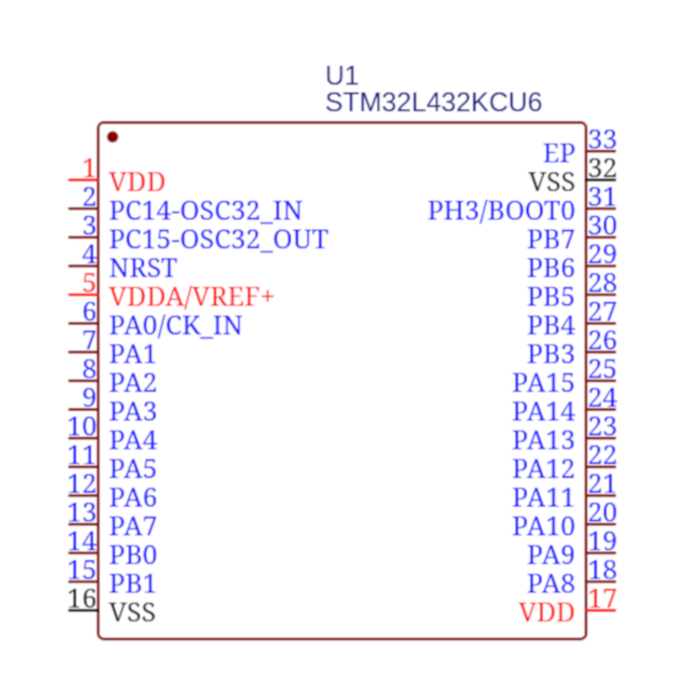
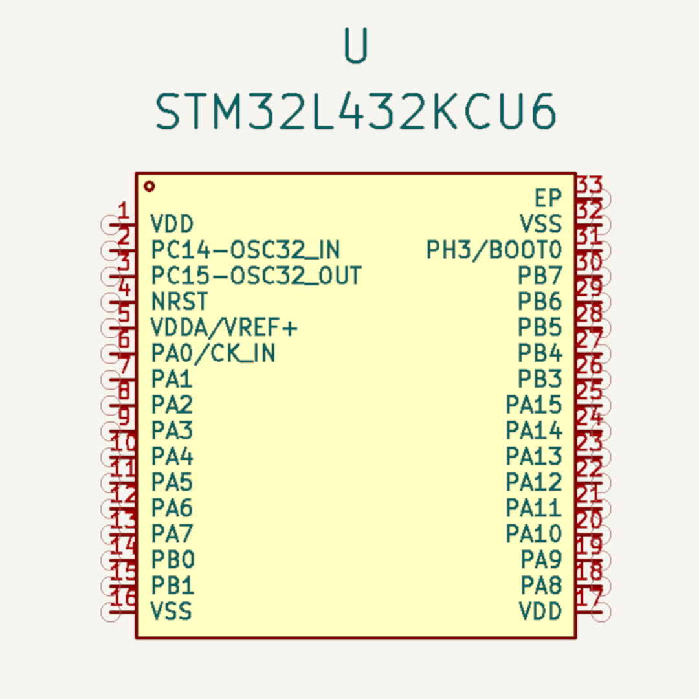
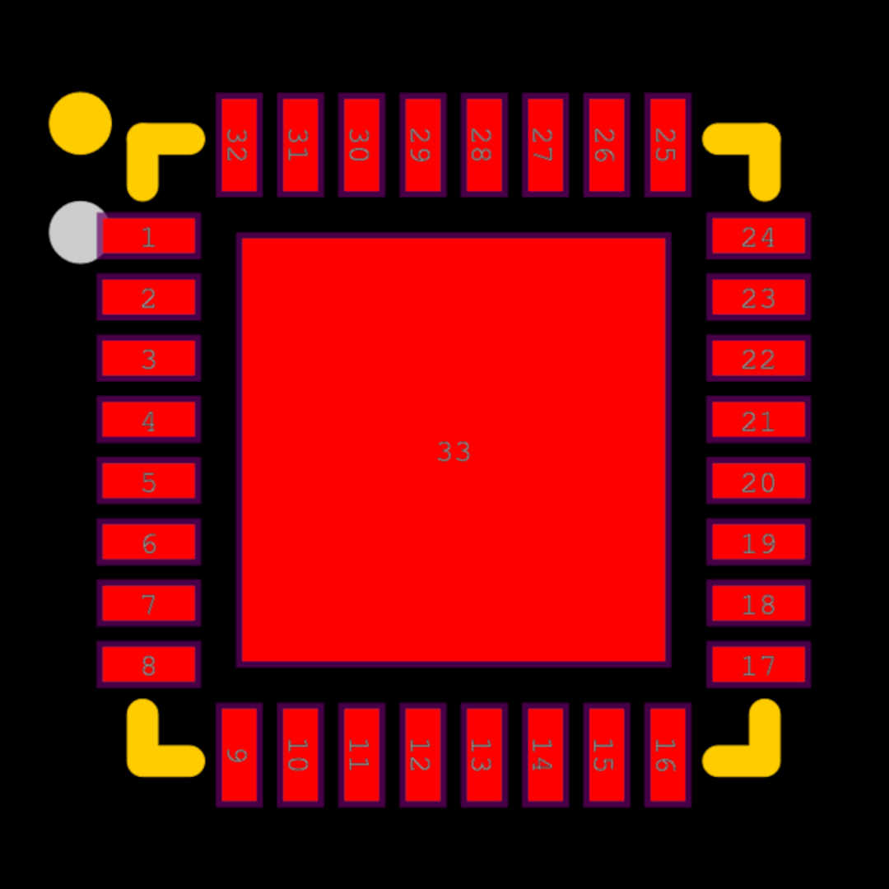
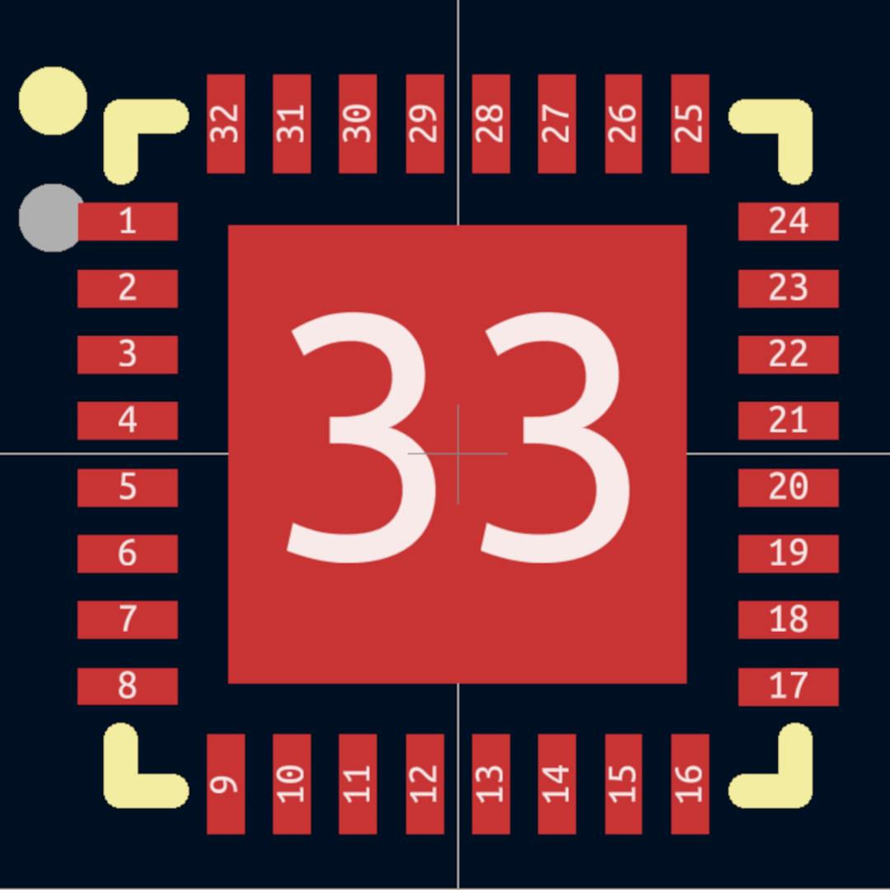
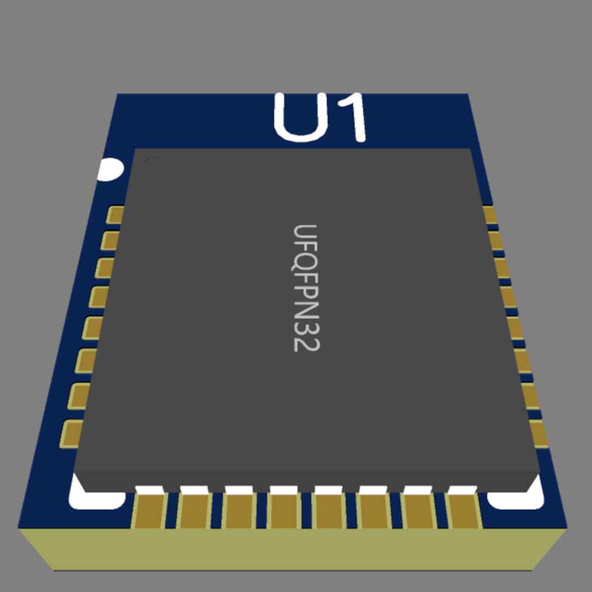

# JLC2KiCadLib

<p style="text-align: center;">

[](https://badge.fury.io/py/JLC2KiCadLib)

[](https://lgtm.com/projects/g/TousstNicolas/JLC2KiCad_lib/context:python)
[](https://pepy.tech/project/jlc2kicadlib)
[](https://github.com/psf/black)
[](https://opensource.org/licenses/MIT)

</p>

JLC2KiCadLib is a python script that generate a component library (schematic, footprint and 3D model) for KiCad from the JLCPCB/easyEDA library.
This script requires **Python 3.6** or higher.

## Exemple 


easyEDA origin | KiCad result
---- | ----
 | 
 | 
 | 

## Installation

Install using pip: 

```
pip install JLC2KiCadLib
```

Install from source:

```
git clone https://github.com/TousstNicolas/JLC2KiCad_lib.git
cd JLC2KiCad_lib 
pip install . 
```

## Usage 

```
positional arguments:
  JLCPCB_part_#         list of JLCPCB part # from the components you want to create

options:
  -h, --help            show this help message and exit
  -dir OUTPUT_DIR       base directory for output library files
  -model_base_variable MODEL_BASE_VARIABLE
                        use -model_base_variable if you want to specifie the base path of the 3D model using a path variable
  --no_footprint        use --no_footprint if you do not want to create the footprint
  --no_schematic        use --no_schematic if you do not want to create the schematic
  -schematic_lib SCHEMATIC_LIB
                        set schematic library name, default is "default_lib"
  -footprint_lib FOOTPRINT_LIB
                        set footprint library name, default is "footprint"
  -logging_level {DEBUG,INFO,WARNING,ERROR,CRITICAL}
                        set logging level. If DEBUG is used, the debug logs are only written in the log file if the option --log_file is set
  --log_file            use --log_file if you want logs to be written in a file
  --skip_existing       use --skip_existing if you want to skip the creation of a symbol/footprint if they already exist
```

Example usage : `JLC2KiCadLib C1337258 C24112 -dir My_lib -schematic_lib My_Schematic_lib`

This example will create the schematic, footprint and 3D model for the two components specified, and will output the schematic in the `./My_lib/Schematic/My_Schematic_lib.lib` file, the footprint and 3D model will be created in the `./My_lib/Footprint`.

The JLCPCB part # is found in the part info section of every component in the JLCPCB part library. 

By default, the library folder will be created in the execution folder. You can specify an absolute path with the -dir option. 

## Dependencies 

This script use the [KicadModTree](https://gitlab.com/kicad/libraries/kicad-footprint-generator) framework to write the footprints. 

## Notes

* Even so I tested the script on a lot of components, be careful and always check the output footprint and schematic.
* I consider this project completed. I will continue to maintain it if a bug report is filed, but I will not develop new functionality in the near future. If you feel that an important feature is missing, please open an issue to discuss it, then you can fork this project with a new branch before submitting a PR. 

## License 

Copyright © 2021 TousstNicolas 

The code is released under the MIT license
